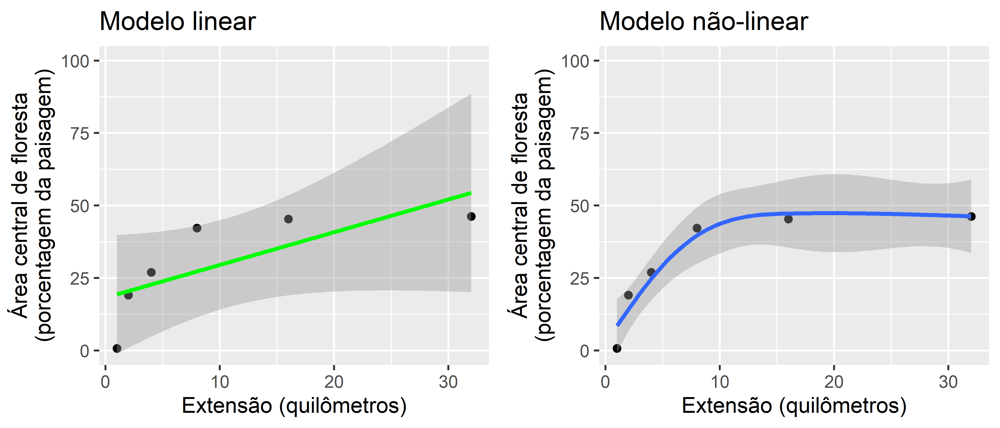
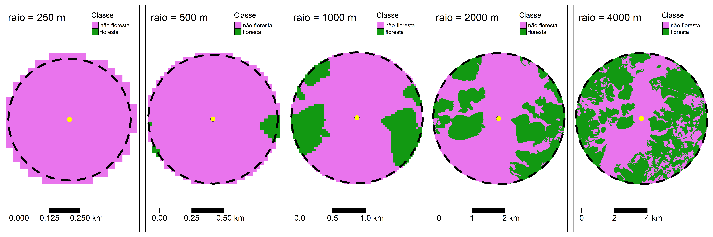

```{r setup, include=FALSE}
library(knitr)
knitr::opts_chunk$set(
  echo = TRUE, collapse = TRUE,
  comment = "#>" 
  )
def_hook <- knit_hooks$get("output")
knit_hooks$set(output = function(x, options) {
  out <- def_hook(x, options)
  return(paste("\\begin{framed}\\begin{verbatim}", x, "\\end{verbatim}\\end{framed}", collapse = "\n"))
})
```

\newpage{}

# Apresentação
Nesta aula (...) vamos .... na ecologia da paisagem através cálculos com a proporção de floresta.
Durante a aula você aprenderá a

# Codigo e R
 * Objetivo não é de apresentar detalhes sobre os cálculos/métodos estatísticas ou os funções no [R](https://cran.r-project.org/). Existem diversos exemplos disponíveis [“Ciência de Dados com R–Introdução......”: ](https://cdr.ibpad.com.br/cdr-intro.pdf) e com google "r cran introdução tutorial".......
 Alem disso, existem grupos de ajuda, como por exemplo: [R Brasil](https://www.facebook.com/groups/rbrasilprogramadores/)
 e 
[Stack Overflow em Português](https://pt.stackoverflow.com/questions/tagged/r)

 * O objetivo é  de apresentar um tutorial mostrado os capacidades e opções para desenvolver e integrar pesquisas na ecologia da paisagem no ambiente estatística de [R](https://cran.r-project.org/)

Porque use R? R tem a capacidade (baseada em codigo) para alternar  entre tarefas de processamento, modelagem e visualização de dados geográficos e não geográficos. Alem disso, como é possível importar, modificar, analisar e visualizar dados espaciais no mesmo ambiente com script/codigo, o R permite fluxos de trabalho transparentes e reproduzíveis ([A Ciência Aberta](https://foster.gitbook.io/manual-de-formacao-em-ciencia-aberta/02introducaoacienciaaberta/01conceito_e_principios_da_ciencia_aberta)).

Aliás, atualmente a grande maioria dos artigos científicos publicados na revista [Landscape Ecology](https://www.springer.com/journal/10980/) incluir análises usando R.

\newpage

## Organização do codigo no tutorial
O tutorial está organizado em etapas de processamento, com blocos de código em caixas cinzas:
```{r, eval=FALSE}
codigo de R para executar
```

Para segue os passos, os blocos de código precisam ser executados em sequência. Se você pular uma etapa, ou rodar fora de sequência o próximo bloco de código provavelmente não funcionará.

As linhas de codigo de R dentro de cada caixa tambem preciso ser executados em sequência. O simbolo `r kableExtra::text_spec("#", bold = TRUE)` é usado para incluir comentarios sobre os passos no codgio (ou seja, linhas começando com  `r kableExtra::text_spec("#", bold = TRUE)` não é codigo de executar).


```{r, eval=FALSE}
# Passo 1
codigo de R passo 1 # texto e numeros tem cores diferentes
# Passo 2
codigo de R passo 2
# Passo 3
codigo de R passo 3
```

Alem disso, os simbolos `r kableExtra::text_spec("#>", bold = TRUE)` e/ou `r kableExtra::text_spec("[1]", bold = TRUE)` no início de uma linha indica o resultado que você verá no console de R, como no proximo exemplo.


```{r, echo=TRUE, results='asis', evaluate = TRUE, collapse = TRUE}
# Passo 1
1+1

# Passo 2
x <- 1 + 1
# Passo 3
x

# Passo 4
x + 1

```

## Métricas da paisagem e pacote "landscapemetrics"

As métricas de paisagem são a forma que os ecólogos de paisagem usam para descrever os padrões espaciais de paisagens para depois avaliar a influência destes padrões espaciais nos padrões e processos ecológicos.
 

landscapemetrics é um pacote R para calcular métricas de paisagem em paisagems categóricos (onde tem uma classificação de cobertura de terra/habitat), em um fluxo de trabalho organizado. O pacote pode ser usado como um substituto do FRAGSTATS ([McGarigal et al. 1995](https://doi.org/10.2737/PNW-GTR-351) https://doi.org/10.2737/PNW-GTR-351), pois oferece um fluxo de trabalho reproduzível para análise de paisagem em um único ambiente. Também permite cálculos de quatro métricas teóricas de complexidade da paisagem:  entropia marginal, entropia condicional, entropia conjunta e informação mútua ([Nowosad e Stepinski 2019](https://doi.org/10.1007/s10980-019-00830-x) https://doi.org/10.1007/s10980-019-00830-x).

Nesse pacote o formato geral para uma função é o seguinte:
A primeira parte é sempre lsm_ ("landscapemetric"), seguinda do “nível_” e por fim a “métrica”. Ou seja, todas as funções começam com lsm_ , daí você deve incluir o nível da análise “p” para patch (ou seja, para a mancha ou fragmento), “c” para classe e “l” para landscape ou seja, para métricas para a paisagem como um todo. E daí existem inúmeras métricas, como por exemplo a <code>cpland</code> (percentual de área central - “core area”) na paisagem, como vimos na aula teórica. Digite o código abaixo e veja o resultado. Leia com atenção e preste particular atenção na organização da página de ajuda.

```{r, message=FALSE, echo=FALSE, eval=TRUE,  warning=FALSE}
library(landscapemetrics)
```

```{r, message=FALSE, eval=FALSE, warning=FALSE}
library(landscapemetrics)
?landscapemetrics
```

No final da página você vai encontrar a palavra "Index". Clique nela e você verá todas as funções do pacote. Desca até as lsm_. . . e clique em algumas delas ali. Explorar!

### Pergunta 1
`r kableExtra::text_spec("Descreva brevemente 2 métricas de cada nível.", color = "blue", bold = TRUE)`


--------------------------------------------------

## Pacotes

Além do "landscapemetrics", precisamos carregar alguns pacotes a mais para facilitar a organização e apresentação de dados espaciais (vector e raster) e os resultados.

Carregar pacotes (que deve esta instalado antes): 
```{r, message=FALSE, warning=FALSE}
library(tidyverse)
library(sf)
library(terra)
library(tmap)
library(gridExtra)
library(kableExtra)
library(mgcv)
```


# Dados

Precisamos o arquivo com os dados de MapBiomas "amostra_mapbiomas_2020.tif", que voces baixaram no tutorial anterior (Escala https://rpubs.com/darren75/escala).
Nós podemos carregar os dados de cobertura da terra "amostra_mapbiomas_2020.tif" com a função <code>rast</code>.
```{r eval=FALSE, echo=TRUE, message=FALSE, warning=FALSE}
# Selecionar e carregar arquivo ""amostra_mapbiomas_2020.tif"
ramostra <- rast(file.choose())
# criar uma nova camada de floresta
floresta_2020 <- mapbiomas_2020
# Com valor de 0
values(floresta_2020) <- 0
# Atualizar categorias florestais agrupados com valor de 1
floresta_2020[mapbiomas_2020==3 | mapbiomas_2020==4] <- 1 
```

```{r, echo=FALSE}
rin <- "data/mapbiomas_AP_utm_rio/utm_cover_AP_rio_2020.tif"
mapbiomas_2020 <- rast(rin)
# criar uma nova camada de floresta
floresta_2020 <- mapbiomas_2020
# Com valor de 0
values(floresta_2020) <- 0
# Atualizar categorias florestais agrupados com valor de 1
floresta_2020[mapbiomas_2020==3 | mapbiomas_2020==4] <- 1 
```

Plotar para verificar, incluindo nomes e os cores para classes de floresta (valor = 1) e não-floresta (valor = 0).

```{r, eval = FALSE}
# Passo necessario para agilizar o processamento
floresta_2020_modal<-aggregate(floresta_2020, fact=10, fun="modal")
# Plot
tm_shape(floresta_2020_modal) +
  tm_raster(style = "cat", 
            palette = c("0" = "#E974ED", "1" ="#129912"), legend.show = FALSE) + 
  tm_add_legend(type = "fill", labels = c("não-floresta", "floresta"),
    col = c("#E974ED", "#129912"), title = "Classe") + 
tm_layout(legend.bg.color = "white")
```

Se esta todo certo, voces devem ter uma imagem parcida como o segunite:

```{r, echo = FALSE, fig.width=5, fig.height=5, fig.cap="Floresta ao redor do Rio Araguari. MapBiomas 2020 reclassificado em floresta e não-floresta."}
# Passo necessario para agilizar o processamento
floresta_2020_modal<-aggregate(floresta_2020, fact=10, fun="modal")
# Plot
tm_shape(floresta_2020_modal) +
  tm_raster(style = "cat", 
            palette = c("0" = "#E974ED", "1" ="#129912"), legend.show = FALSE) + 
  tm_add_legend(type = "fill", labels = c("não-floresta", "floresta"),
    col = c("#E974ED", "#129912"), title = "Classe") + 
tm_layout(legend.bg.color = "white")
```


Agora temos a paisagem, precisamos tambem os pontos de amostra. Por isso, precisamos carregar os dados de rios e pontos de amostragem que usamos no tutorial Escala - arquivo "rivers.GPKG". Vamos carregar as camadas que voces baixaram no tutorial anterior. Selecionando o arquivo "rivers.GPKG", e carregando as camadas "midpoints" e "centerline".

```{r, echo=FALSE, eval=TRUE, message=FALSE, warning=FALSE, results='hide'}
meuSIG <- "data/rivers.gpkg"
fs <- file.size(meuSIG)/(1024^2)
# pontos cada 5 km
rsm_31976 <- sf::st_read(meuSIG, layer = "midpoints") %>% 
  st_transform(31976) 
# linha central de rios
rsl_31976 <- sf::st_read(meuSIG, layer = "centerline") %>% 
  st_transform(31976) 
```


```{r, eval=FALSE, message=FALSE, results = FALSE}
#  Selecionar o arquivo "rivers.GPKG",
meuSIG <- file.choose()
# Carregar pontos cada 5 km, camada midpoints
rsm_31976 <- sf::st_read(meuSIG, layer = "midpoints") %>% 
  st_transform(31976) 
# Carregar linha central de rios, camada centerline
rsl_31976 <- sf::st_read(meuSIG, layer = "centerline") %>% 
  st_transform(31976) 
```

\newpage

Visulaizer para verificar. 
```{r, eval=FALSE}
# Passo necessario para agilizar o processamento
floresta_2020_modal<-aggregate(floresta_2020, fact=10, fun="modal")
# Plot
tm_shape(floresta_2020_modal) +
  tm_raster(style = "cat", 
            palette = c("0" = "#E974ED", "1" ="#129912"), legend.show = FALSE) + 
  tm_add_legend(type = "fill", labels = c("não-floresta", "floresta"),
    col = c("#E974ED", "#129912"), title = "Classe") + 
tm_shape(rsl_31976) + 
  tm_lines(col="blue") + 
tm_shape(rsm_31976) + 
  tm_dots(size = 0.2, col = "yellow") + 
tm_layout(legend.bg.color="white")
```

Depois de executar ("run") o código acima, você deverá ver a figura a seguir.

```{r, echo=FALSE, fig.width=5, fig.height=5, fig.cap="Cobertura da terra ao redor do Rio Araguari em 2020. Mostrando os pontos de amostragem (pontos amarelas) cada 5 quilômetros ao longo do rio (linha azul)."}
# Passo necessario para agilizar o processamento
mapbiomas_2020_modal<-aggregate(mapbiomas_2020, fact=10, fun="modal")
# Plot
tm_shape(floresta_2020_modal) +
  tm_raster(style = "cat", 
            palette = c("0" = "#E974ED", "1" ="#129912"), legend.show = FALSE) + 
  tm_add_legend(type = "fill", labels = c("não-floresta", "floresta"),
    col = c("#E974ED", "#129912"), title = "Classe") + 
tm_shape(rsl_31976) + 
  tm_lines(col="blue") + 
tm_shape(rsm_31976) + 
  tm_dots(size = 0.2, col = "yellow") + 
tm_layout(legend.bg.color="white")
```

--------------------------------------------


\newpage


# Calculo de métricas
Para ilustrar como rodar as funções na landscapemetrics, vamos calcular a área central na paisagem que usamos no tutorial de escala. Estamos olhando uma classe (floresta), portanto vamos incluir as métricas para nível de classe. Alem disso, as métricas de paisagem em nível de classe são mais eficazes na definição de processos ecológicos (Tischendorf, L. Can landscape indices predict ecological processes consistently?. Landscape Ecology 16, 235–254 (2001). 
https://doi.org/10.1023/A:1011112719782.).

Para calcular as métricas de paisagem dentro de um certo buffer em torno de pontos de amostra, existe a função <code>sample_lsm()</code>. Através da função <code>sample_lsm()</code> podemos calcular mais de 50 métricas da paisagem, dentro de extensões diferentes.

Para a função <code>sample_lsm()</code> funcionar, precisamos informar 
(i) a paisagem (arquivo de raster), (ii) ponto (vector), 
(iii) raio, e por final (iv) a métrica  desejada.

##  Ponto único, raio único, métrica única

Métricas de área central ("core") são consideradas medidas da qualidade de hábitat, uma vez que indica quanto existe realmente de área efetiva de um fragmento, após descontar-se o efeito de borda. Vamos calcular a percentual de área central ("core area") no entorno de um ponto de amostragem. Isso seria, a percentual de áreas centrais (excluídas as bordas de 30 m) em relação à área total da paisagem.


```{r, echo=TRUE, message=FALSE, warning=FALSE}
minha_amostra_1000 <- sample_lsm(floresta_2020, y = rsm_31976[1, ], 
                            size = 1000, shape = "circle", 
                            metric = "cpland", 
                            edge_depth = 1) 
```

Depois que executar ("run"), podemos olhar os dados com o codigo a seguir. 
```{r, eval=FALSE}
minha_amostra_1000
```

Os dados deve ter os valores:
```{r, echo=FALSE, message=FALSE, warning=FALSE}
minha_amostra_1000 %>% 
  kbl() %>%
  kable_styling(full_width = F,  latex_options = "hold_position")
```

### Pergunta

`r kableExtra::text_spec("O modelo mancha-corredor-matriz é frequentemente adotado na ecologia da paisagem. Com base nas aulas teóricas e usando os valores no objeto minha_amostra_1000 apresentados na tabela acima, identificar qual classe representar a matriz na paisagem. Há alguma informação faltando que limita a sua capacidade de identificar qual classe representar a matriz? Se sim, o que precisa ser adicionado? Justifique as suas respostas de forma clara e concisa.", color = "blue", bold = TRUE)`


\newpage

## Ponto único, distâncias variados, métrica única

Core area for all exten...
```{r, echo=TRUE, message=FALSE, warning=FALSE}
# raio 250 metros
sample_lsm(floresta_2020, y = rsm_31976[1, ], 
           size = 250, shape = "circle", 
           metric = "cpland") %>% 
  mutate(raio = 250) -> minha_amostra_250 
# raio 500 metros
sample_lsm(floresta_2020, y = rsm_31976[1, ], 
           size = 500, shape = "circle", 
           metric = "cpland")  %>% 
  mutate(raio = 500) -> minha_amostra_500
# raio 1 km (1000 metros)
sample_lsm(floresta_2020, y = rsm_31976[1, ], 
           size = 1000, shape = "circle", 
           metric = "cpland")  %>% 
  mutate(raio = 1000) -> minha_amostra_1000
# raio 2 km
sample_lsm(floresta_2020, y = rsm_31976[1, ], 
           size = 2000, shape = "circle", 
           metric = "cpland") %>% 
  mutate(raio = 2000) -> minha_amostra_2000
# raio 4 km
sample_lsm(floresta_2020, y = rsm_31976[1, ], 
           size = 4000, shape = "circle", 
           metric = "cpland")  %>% 
  mutate(raio = 4000) -> minha_amostra_4000
# raio 8 km
sample_lsm(floresta_2020, y = rsm_31976[1, ], 
           size = 8000, shape = "circle", 
           metric = "cpland")  %>% 
  mutate(raio = 8000) -> minha_amostra_8000
# raio 16 km
sample_lsm(floresta_2020, y = rsm_31976[1, ], 
           size = 16000, shape = "circle", 
           metric = "cpland")  %>% 
  mutate(raio = 16000) -> minha_amostra_16000
```

\newpage

join

```{r, echo=TRUE, message=FALSE, warning=FALSE}
bind_rows(minha_amostra_250, 
          minha_amostra_500, 
          minha_amostra_1000, 
          minha_amostra_2000, 
          minha_amostra_4000, 
          minha_amostra_8000, 
          minha_amostra_16000) -> amostras_metrica

```


### Make a graph
```{r}
amostras_metrica %>% 
  filter(class==1) %>%
  ggplot(aes(x=2*raio, y=value)) + 
  geom_point() + 
  labs(x = "Extensão (metros)", 
       y = "Área central de floresta (porcentagem da paisagem)")
```

### Make a better graph
```{r}
amostras_metrica %>% 
  filter(class==1) %>%
  ggplot(aes(x=(2*raio)/1000, y=value)) + 
  geom_point() + 
  stat_smooth(method = "lm", se = FALSE, color = "green") + 
  labs(x = "Extensão (quilômetros)", 
       y = "Área central de floresta\n(porcentagem da paisagem)")
```

\newpage

### Compare linear and non linear
```{r create-fig-comp, echo=FALSE, message=FALSE, warning=FALSE}
amostras_metrica %>% 
  filter(class==1) %>%
  ggplot(aes(x=(2*raio)/1000, y=value)) + 
  geom_point() + 
  stat_smooth(method = "lm", color = "green") + 
  coord_cartesian(ylim = c(0,100)) +
  labs(title = "Modelo linear", 
       x = "Extensão (quilômetros)", 
       y = "Área central de floresta\n(porcentagem da paisagem)") -> fig_lm

amostras_metrica %>% 
  filter(class==1) %>%
  ggplot(aes(x=(2*raio)/1000, y=value)) + 
  geom_point() + 
  stat_smooth(method = "gam", formula = y ~ s(x, k = 5)) + 
  coord_cartesian(ylim = c(0,100)) +
  labs(title = "Modelo não-linear", 
       x = "Extensão (quilômetros)", 
       y = "Área central de floresta\n(porcentagem da paisagem)") -> fig_gam

pdf("figures/fig_comp_linear.pdf", width=7, height=3)
grid.arrange(fig_lm, fig_gam, nrow=1)
invisible(dev.off())

png("figures/fig_comp_linear.png", width=7, height=3, 
    units="in", res = 600)
grid.arrange(fig_lm, fig_gam, nrow=1)
invisible(dev.off())

```

include figure

more text

```{r insert-fig-comp, echo=FALSE, message=FALSE, warning=FALSE, fig.cap="Comparação de padrões lineares e não-lineares."}

```


### Pergunta
`r kableExtra::text_spec("Comparar os resultados apresentados nas figuras com modelos lineares e não-lineares. Qual modelo seria mais adequado para identificar limiares no padrão de área central de floresta?", color = "blue", bold = TRUE)`

-------

\newpage

## Ponto único, distâncias variados, métricas variadas

Como as mudanças na estrutura da paisagem caracterizam-se por serem não-lineares, para desenvolver análises estatísticas e evidências robustos pode (i) aplicar uma transformação (por exemplo, "log") ou (ii) adotar modelos não-lineares. Aqui, usaremos modelos não lineares para comparar padrões em diferentes métricas da paisagem  em diferentes extensões.

```{r, echo=FALSE}
#250 m
rsm_31976_b250 <- st_buffer(rsm_31976[1, ], dist = 250)
buffer.forest1.250m <- crop(floresta_2020, rsm_31976_b250, snap="out")
buffer.forest1.250m <- mask(buffer.forest1.250m, rsm_31976_b250, touches=TRUE)
# 500 m
rsm_31976_b500 <- st_buffer(rsm_31976[1, ], dist = 500)
buffer.forest1.500m <- crop(floresta_2020, snap="out", rsm_31976_b500)
buffer.forest1.500m <- mask(buffer.forest1.500m, touches=TRUE, rsm_31976_b500)
# 1000 m
rsm_31976_b1000 <- st_buffer(rsm_31976[1, ], dist = 1000)
buffer.forest1.1km <- crop(floresta_2020, rsm_31976_b1000)
buffer.forest1.1km <- mask(buffer.forest1.1km, rsm_31976_b1000)
# 2000 m
rsm_31976_b2000 <- st_buffer(rsm_31976[1, ], dist = 2000)
buffer.forest1.2000m <- crop(floresta_2020, rsm_31976_b2000)
buffer.forest1.2000m <- mask(buffer.forest1.2000m, rsm_31976_b2000)
# 4000 m
rsm_31976_b4000 <- st_buffer(rsm_31976[1, ], dist = 4000)
buffer.forest1.4000m <- crop(floresta_2020, rsm_31976_b4000)
buffer.forest1.4000m <- mask(buffer.forest1.4000m, rsm_31976_b4000)
#fig 250
fig_250m <- tm_shape(buffer.forest1.250m) +
  tm_raster(style = "cat", 
            palette = c("0" = "#E974ED", 
                        "1" ="#129912"), legend.show = FALSE) + 
  tm_shape(rsm_31976[1, ]) + 
  tm_symbols(shape =21, col = "yellow", 
            border.col = "black", border.lwd = 0.2, size=0.5) + 
  tm_shape(rsm_31976_b250) +
  tm_borders(col = "black", lwd = 4, lty = "dashed") + 
  tm_add_legend(type = "fill", 
    labels = c("não-floresta", "floresta"),
    col = c("#E974ED", "#129912"),
    title = "Classe") + 
tm_scale_bar(breaks = c(0, 0.125, 0.25), text.size = 1, position=c("left", "bottom")) +
tm_layout(title = "raio = 250 m", 
          legend.position = c("right","top"),
          legend.bg.color = "white")
# fig 500 m
fig_500m <- tm_shape(buffer.forest1.500m) +
  tm_raster(style = "cat", 
            palette = c("0" = "#E974ED", 
                        "1" ="#129912"), legend.show = FALSE) + 
  tm_shape(rsm_31976[1, ]) + 
  tm_symbols(shape =21, col = "yellow", 
            border.col = "black", border.lwd = 0.2, size=0.5) + 
  tm_shape(rsm_31976_b500) +
  tm_borders(col = "black", lwd = 4, lty = "dashed") + 
  tm_add_legend(type = "fill", 
    labels = c("não-floresta", "floresta"),
    col = c("#E974ED", "#129912"),
    title = "Classe") + 
tm_scale_bar(breaks = c(0, 0.25, 0.5), text.size = 1, 
             position=c("left", "bottom")) +
tm_layout(title = "raio = 500 m", 
          legend.position = c("right","top"),
          legend.bg.color = "white")
# fig 1000 m
fig_1000m <- tm_shape(buffer.forest1.1km) +
  tm_raster(style = "cat", 
            palette = c("0" = "#E974ED", 
                        "1" ="#129912"), legend.show = FALSE) + 
  tm_shape(rsm_31976[1, ]) + 
  tm_symbols(shape =21, col = "yellow", 
            border.col = "black", border.lwd = 0.2, size=0.5) + 
  tm_shape(rsm_31976_b1000) +
  tm_borders(col = "black", lwd = 4, lty = "dashed") + 
  tm_add_legend(type = "fill", 
    labels = c("não-floresta", "floresta"),
    col = c("#E974ED", "#129912"),
    title = "Classe") + 
tm_scale_bar(breaks = c(0, 0.5, 1), text.size = 1, 
             position=c("left", "bottom")) +
tm_layout(title = "raio = 1000 m", 
legend.position = c("right","top"),
          legend.bg.color = "white")
# fig 2000 m
fig_2000m <- tm_shape(buffer.forest1.2000m) +
  tm_raster(style = "cat", 
            palette = c("0" = "#E974ED", 
                        "1" ="#129912"), legend.show = FALSE) + 
  tm_shape(rsm_31976[1, ]) + 
  tm_symbols(shape =21, col = "yellow", 
            border.col = "black", border.lwd = 0.2, size=0.5) + 
  tm_shape(rsm_31976_b2000) +
  tm_borders(col = "black", lwd = 4, lty = "dashed") + 
  tm_add_legend(type = "fill", 
    labels = c("não-floresta", "floresta"),
    col = c("#E974ED", "#129912"),
    title = "Classe") + 
tm_scale_bar(breaks = c(0, 1, 2), text.size = 1, 
             position=c("left", "bottom")) +
tm_layout(title = "raio = 2000 m", 
legend.position = c("right","top"),
          legend.bg.color = "white")
#fig 4000 m 
fig_4000m <- tm_shape(buffer.forest1.4000m) +
  tm_raster(style = "cat", 
            palette = c("0" = "#E974ED", 
                        "1" ="#129912"), legend.show = FALSE) + 
  tm_shape(rsm_31976[1, ]) + 
  tm_symbols(shape =21, col = "yellow", 
            border.col = "black", border.lwd = 0.2, size=0.5) + 
  tm_shape(rsm_31976_b4000) +
  tm_borders(col = "black", lwd = 4, lty = "dashed") + 
  tm_add_legend(type = "fill", 
    labels = c("não-floresta", "floresta"),
    col = c("#E974ED", "#129912"),
    title = "Classe") + 
tm_scale_bar(breaks = c(0, 2, 4), text.size = 1, 
             position=c("left", "bottom")) +
tm_layout(title = "raio = 4000 m", 
legend.position = c("right","top"),
          legend.bg.color = "white")
#Export plot
png("figures/fig_extensions.png", width=15, height=5, 
    res=600, units="in")
tmap_arrange(fig_250m, fig_500m, fig_1000m, fig_2000m, fig_4000m, nrow=1)
invisible(dev.off())
```

Plot extensions
nclude figure

more text

```{r insert-fig-exten, echo=FALSE, message=FALSE, warning=FALSE, out.width="90%", out.height="90%", fig.cap="Cobertura florestal em extensões diferentes ao redor de um local de amostragem."}

```


see what happens

-------


Multiplwe metricas area for all exten...
<code>sample_lsm()</code>

Aqui vamos .........

 * Métricas de área e borda. Quantificam a composição da paisagem e fornecem sobre ela informações importantes sobre a dinâmica de populações vegetais e animais  
    <code>pland</code> = area and edge metric / percentage of landscape 
percentagem da paisagem Porcentagem de cobertura da classe na paisagem.  
    <code>ed</code> = area and edge metric / edge density . densidade de borda que é igual à soma dos comprimentos (m) de todos os segmentos de borda que envolvem o fragmento, dividida pela área total da paisagem (m²), sendo posteriormente convertido em hectares.

 * Métricas de área central. Quantificam a composição da paisagem. 
    <code>cpland</code> = core area metric / core area percentage of landscape / 
(percentual de área central ("core") na paisagem) Percentual de áreas centrais (excluídas as bordas de 30 m) em relação à área total da paisagem. O termo "Core area" foi traduzido como área central ou área núcleo. Aqui vamos adotar área central.

 * Métricas de contágio e agregação. Quantificam a configuração da paisagem:
    <code>pd</code> = aggegation metric / patch density
    <code>cohesion</code> = aggregation metric / patch cohesion index.
    


```{r, echo=TRUE, message=FALSE, warning=FALSE}

minhas_metricas <- c("pland", "ed", "cpland", "pd","cohesion")

# raio 250 metros
sample_lsm(floresta_2020, y = rsm_31976[1, ], 
           size = 250, shape = "circle", 
           metric = minhas_metricas) %>% 
  mutate(raio = 250) -> metricas_amostra_250 
# raio 500 metros
sample_lsm(floresta_2020, y = rsm_31976[1, ], 
           size = 500, shape = "circle", 
           metric = minhas_metricas)  %>% 
  mutate(raio = 500) -> metricas_amostra_500
# raio 1 km (1000 metros)
sample_lsm(floresta_2020, y = rsm_31976[1, ], 
           size = 1000, shape = "circle", 
           metric = minhas_metricas)  %>% 
  mutate(raio = 1000) -> metricas_amostra_1000
# raio 2 km
sample_lsm(floresta_2020, y = rsm_31976[1, ], 
           size = 2000, shape = "circle", 
           metric = minhas_metricas) %>% 
  mutate(raio = 2000) -> metricas_amostra_2000
# raio 4 km
sample_lsm(floresta_2020, y = rsm_31976[1, ], 
           size = 4000, shape = "circle", 
           metric = minhas_metricas)  %>% 
  mutate(raio = 4000) -> metricas_amostra_4000
# raio 8 km
sample_lsm(floresta_2020, y = rsm_31976[1, ], 
           size = 8000, shape = "circle", 
           metric = minhas_metricas)  %>% 
  mutate(raio = 8000) -> metricas_amostra_8000
# raio 16 km
sample_lsm(floresta_2020, y = rsm_31976[1, ], 
           size = 16000, shape = "circle", 
           metric = minhas_metricas)  %>% 
  mutate(raio = 16000) -> metricas_amostra_16000
```

join

```{r, echo=TRUE, message=FALSE, warning=FALSE}
bind_rows(metricas_amostra_250, 
          metricas_amostra_500, 
          metricas_amostra_1000, 
          metricas_amostra_2000, 
          metricas_amostra_4000, 
          metricas_amostra_8000, 
          metricas_amostra_16000) -> amostras_metricas

```

get forest 
```{r, echo=TRUE, message=FALSE, warning=FALSE}
amostras_metricas %>% 
  filter(class==1) -> amostras_metricas_floresta

```

Best to include forest metrics 250 as 0 or NA?

Plot

```{r}
amostras_metricas_floresta %>% 
  ggplot(aes(x=(2*raio)/1000, y=value)) + 
  geom_point() + 
  stat_smooth(method = "gam", formula = y ~ s(x, k = 5), 
               se=FALSE) + 
  facet_wrap(~metric, scales = "free_y") +
  labs(title = "Multiple metris",
    x = "extensão (quilômetros)", 
    y = "metric value")
```

### Pergunta 

`r kableExtra::text_spec("Usando como base o conteudo das aulas, leitura disponivel no Google Classroom (Base teórica 4 Dados, métricas, analises), e/ou exemplos apresentados aqui no tutorial, selecione seis métricas de nível classe para caracterizar a paisagem de estudo e objectivos da sua projeto. Justifique sua seleção de forma clara e concisa, apoie sua escolha com exemplos da literatura científica.", color = "blue", bold = TRUE)`

----------------------------------------------------------