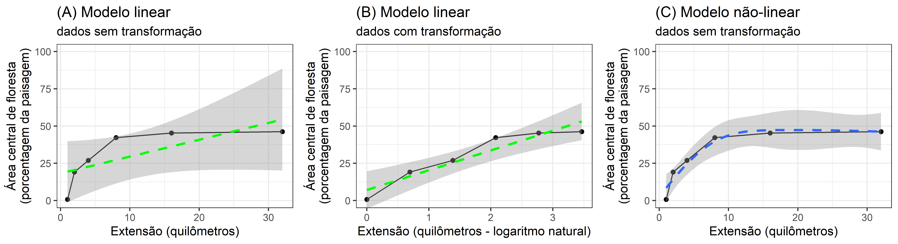

```{r setup, include=FALSE}
library(knitr)
knitr::opts_chunk$set(
  echo = TRUE, collapse = TRUE,
  comment = "#>" 
  )
def_hook <- knit_hooks$get("output")
knit_hooks$set(output = function(x, options) {
  out <- def_hook(x, options)
  return(paste("\\begin{framed}\\begin{verbatim}", x, "\\end{verbatim}\\end{framed}", collapse = "\n"))
})
```

\newpage{}

# Apresentação
Nesta aula (...) vamos .... na ecologia da paisagem através cálculos com a proporção de floresta.
Durante a aula você aprenderá a

# Codigo e R
 * Objetivo não é de apresentar detalhes sobre os cálculos/métodos estatísticas ou os funções no [R](https://cran.r-project.org/). Existem diversos exemplos disponíveis [“Ciência de Dados com R–Introdução......”: ](https://cdr.ibpad.com.br/cdr-intro.pdf) e com google "r cran introdução tutorial".......
 Alem disso, existem grupos de ajuda, como por exemplo: [R Brasil](https://www.facebook.com/groups/rbrasilprogramadores/)
 e 
[Stack Overflow em Português](https://pt.stackoverflow.com/questions/tagged/r)

 * O objetivo é  de apresentar um tutorial mostrado os capacidades e opções para desenvolver e integrar pesquisas na ecologia da paisagem no ambiente estatística de [R](https://cran.r-project.org/)

Porque use R? R tem a capacidade (baseada em codigo) para alternar  entre tarefas de processamento, modelagem e visualização de dados geográficos e não geográficos. Alem disso, como é possível importar, modificar, analisar e visualizar dados espaciais no mesmo ambiente com script/codigo, o R permite fluxos de trabalho transparentes e reproduzíveis ([A Ciência Aberta](https://foster.gitbook.io/manual-de-formacao-em-ciencia-aberta/02introducaoacienciaaberta/01conceito_e_principios_da_ciencia_aberta)).

Além disso, atualmente a grande maioria dos artigos científicos publicados na revista [Landscape Ecology](https://www.springer.com/journal/10980/) incluir análise usando R.

# Packages
```{r, message=FALSE, warning=FALSE}
library(tidyverse)
library(sf)
library(terra)
library(tmap)
library(landscapemetrics)
library(gridExtra)
library(kableExtra)
library(mgcv)
```

# Data
load raster
```{r, echo=FALSE}
rin <- "data/mapbiomas_AP_utm_rio/utm_cover_AP_rio_2020.tif"

mapbiomas_2020 <- rast(rin)
# criar uma nova camada de floresta
floresta_2020 <- mapbiomas_2020
# Com valor de 0
values(floresta_2020) <- 0
# Atualizar categorias florestais agrupados com valor de 1
floresta_2020[mapbiomas_2020==3 | mapbiomas_2020==4] <- 1 
```

River lines
```{r, echo=FALSE, eval=TRUE, message=FALSE, warning=FALSE}
meuSIG <- "data/rivers.gpkg"
fs <- file.size(meuSIG)/(1024^2)
```

Load
```{r, message=FALSE, results = FALSE}
# pontos cada 5 km
rsm_31976 <- sf::st_read(meuSIG, layer = "midpoints") %>% 
  st_transform(31976) 
# linha central de rios
rsl_31976 <- sf::st_read(meuSIG, layer = "centerline") %>% 
  st_transform(31976) 
```

\newpage

## Plot
```{r, eval=FALSE}
# Passo necessario para agilizar o processamento
mapbiomas_2020_modal<-aggregate(mapbiomas_2020, fact=10, fun="modal")
# Plot
tm_shape(mapbiomas_2020_modal) +
  tm_raster(title = "Classe", style = "cat", palette = "Set3") + 
tm_shape(rsl_31976) + 
  tm_lines(col="blue") + 
tm_shape(rsm_31976) + 
  tm_dots(size = 0.2, col = "yellow") + 
tm_compass(position=c("left", "top")) +
tm_scale_bar(breaks = c(0, 25, 50), text.size = 1, 
             position=c("left", "bottom")) +
tm_layout(legend.position = c("right","top"), legend.bg.color="white")
```

Depois de executar ("run") o código acima, você deverá ver a figura a seguir.

```{r, echo=FALSE, fig.width=5, fig.height=5, fig.cap="Cobertura da terra ao redor do Rio Araguari em 2020. Mostrando os pontos de amostragem (pontos amarelas) cada 5 quilômetros ao longo do rio."}
# Passo necessario para agilizar o processamento
mapbiomas_2020_modal<-aggregate(mapbiomas_2020, fact=10, fun="modal")
# Plot
tm_shape(mapbiomas_2020_modal) +
  tm_raster(title = "Classe", style = "cat", palette = "Set3") + 
tm_shape(rsl_31976) + 
  tm_lines(col="blue") + 
tm_shape(rsm_31976) + 
  tm_dots(size = 0.2, col = "yellow") + 
tm_compass(position=c("left", "top")) +
tm_scale_bar(breaks = c(0, 25, 50), text.size = 1, 
             position=c("left", "bottom")) +
tm_layout(legend.position = c("right","top"), legend.bg.color="white")
```

--------------------------------------------


\newpage


# Area within buffer

##  Ponto único, raio único
Para amostrar métricas de paisagem dentro de um certo buffer em torno de pontos de amostra, existe a função <code>sample_lsm()</code>.

Através da função <code>sample_lsm()</code> podemos calcular mais de 50 métricas da paisagem, dentro de extensões diferentes.

cpland Core area percentage of landscape (Core area metric)
C%LAND (percentual de área central ("core") na paisagem) Percentual de áreas centrais (excluídas as bordas de 30 m) em relação à área total da paisagem.
Métricas de área central ("core") É considerada medida da qualidade de hábitat, uma vez que indica quanto existe realmente de área efetiva de um fragmento, após descontar-se o efeito de borda. 

```{r, echo=TRUE, message=FALSE, warning=FALSE}
minha_amostra_1000 <- sample_lsm(floresta_2020, y = rsm_31976[1, ], 
                            size = 1000, shape = "circle", 
                            metric = "cpland", 
                            edge_depth = 1) 
```

Depois que executar ("run"), podemos olhar os dados com o codigo a seguir. 
```{r, eval=FALSE}
minha_amostra_1000
```

Os dados deve ter os valores:
```{r, echo=FALSE, message=FALSE, warning=FALSE}
minha_amostra_1000 %>% 
  kbl() %>%
  kable_styling(full_width = F,  latex_options = "hold_position")
```

\newpage

## Ponto único, distâncias variados

Core area for all exten...
```{r, echo=TRUE, message=FALSE, warning=FALSE}
# raio 250 metros
sample_lsm(floresta_2020, y = rsm_31976[1, ], 
           size = 250, shape = "circle", 
           metric = "cpland") %>% 
  mutate(raio = 250) -> minha_amostra_250 
# raio 500 metros
sample_lsm(floresta_2020, y = rsm_31976[1, ], 
           size = 500, shape = "circle", 
           metric = "cpland")  %>% 
  mutate(raio = 500) -> minha_amostra_500
# raio 1 km (1000 metros)
sample_lsm(floresta_2020, y = rsm_31976[1, ], 
           size = 1000, shape = "circle", 
           metric = "cpland")  %>% 
  mutate(raio = 1000) -> minha_amostra_1000
# raio 2 km
sample_lsm(floresta_2020, y = rsm_31976[1, ], 
           size = 2000, shape = "circle", 
           metric = "cpland") %>% 
  mutate(raio = 2000) -> minha_amostra_2000
# raio 4 km
sample_lsm(floresta_2020, y = rsm_31976[1, ], 
           size = 4000, shape = "circle", 
           metric = "cpland")  %>% 
  mutate(raio = 4000) -> minha_amostra_4000
# raio 8 km
sample_lsm(floresta_2020, y = rsm_31976[1, ], 
           size = 8000, shape = "circle", 
           metric = "cpland")  %>% 
  mutate(raio = 8000) -> minha_amostra_8000
# raio 16 km
sample_lsm(floresta_2020, y = rsm_31976[1, ], 
           size = 16000, shape = "circle", 
           metric = "cpland")  %>% 
  mutate(raio = 16000) -> minha_amostra_16000
```

\newpage

join

```{r, echo=TRUE, message=FALSE, warning=FALSE}
bind_rows(minha_amostra_250, 
          minha_amostra_500, 
          minha_amostra_1000, 
          minha_amostra_2000, 
          minha_amostra_4000, 
          minha_amostra_8000, 
          minha_amostra_16000) -> amostras_metrica

```


### Make a graph
```{r}
amostras_metrica %>% 
  filter(class==1) %>%
  ggplot(aes(x=2*raio, y=value)) + 
  geom_point() + 
  labs(x = "Extensão (metros)", y = "Área central (porcentagem da paisagem)")
```

### Make a better graph
```{r}
amostras_metrica %>% 
  filter(class==1) %>%
  ggplot(aes(x=(2*raio)/1000, y=value)) + 
  geom_point() + 
  stat_smooth(method = "lm", se = FALSE, color = "green") + 
  labs(x = "Extensão (quilômetros)", y = "Área central (porcentagem da paisagem)")
```

\newpage

### Compare linear and non linear
```{r create-fig-comp, echo=FALSE, message=FALSE, warning=FALSE}
amostras_metrica %>% 
  filter(class==1) %>%
  ggplot(aes(x=(2*raio)/1000, y=value)) + 
  geom_point() + 
  stat_smooth(method = "lm", color = "green") + 
  coord_cartesian(ylim = c(0,100)) +
  labs(title = "Modelo linear", 
       x = "Extensão (quilômetros)", 
       y = "Área central (porcentagem da paisagem)") -> fig_lm

amostras_metrica %>% 
  filter(class==1) %>%
  ggplot(aes(x=(2*raio)/1000, y=value)) + 
  geom_point() + 
  stat_smooth(method = "gam", formula = y ~ s(x, k = 5)) + 
  coord_cartesian(ylim = c(0,100)) +
  labs(title = "Modelo não-linear", 
       x = "Extensão (quilômetros)", 
       y = "Área central (porcentagem da paisagem)") -> fig_gam

pdf("figures/fig_comp_linear.pdf", width=7, height=3)
grid.arrange(fig_lm, fig_gam, nrow=1)
invisible(dev.off())

png("figures/fig_comp_linear.png", width=7, height=3, 
    units="in", res = 600)
grid.arrange(fig_lm, fig_gam, nrow=1)
invisible(dev.off())

```

include figure

more text

```{r insert-fig-comp, echo=FALSE, message=FALSE, warning=FALSE}

```


see what happens

-------

\newpage

## Ponto único, distâncias variados, métricas variadas


Using the same point 

```{r, echo=FALSE}
#250 m
rsm_31976_b250 <- st_buffer(rsm_31976[1, ], dist = 250)
buffer.forest1.250m <- crop(floresta_2020, rsm_31976_b250, snap="out")
buffer.forest1.250m <- mask(buffer.forest1.250m, rsm_31976_b250, touches=TRUE)
# 500 m
rsm_31976_b500 <- st_buffer(rsm_31976[1, ], dist = 500)
buffer.forest1.500m <- crop(floresta_2020, snap="out", rsm_31976_b500)
buffer.forest1.500m <- mask(buffer.forest1.500m, touches=TRUE, rsm_31976_b500)
# 1000 m
rsm_31976_b1000 <- st_buffer(rsm_31976[1, ], dist = 1000)
buffer.forest1.1km <- crop(floresta_2020, rsm_31976_b1000)
buffer.forest1.1km <- mask(buffer.forest1.1km, rsm_31976_b1000)
# 2000 m
rsm_31976_b2000 <- st_buffer(rsm_31976[1, ], dist = 2000)
buffer.forest1.2000m <- crop(floresta_2020, rsm_31976_b2000)
buffer.forest1.2000m <- mask(buffer.forest1.2000m, rsm_31976_b2000)
# 4000 m
rsm_31976_b4000 <- st_buffer(rsm_31976[1, ], dist = 4000)
buffer.forest1.4000m <- crop(floresta_2020, rsm_31976_b4000)
buffer.forest1.4000m <- mask(buffer.forest1.4000m, rsm_31976_b4000)
#fig 250
fig_250m <- tm_shape(buffer.forest1.250m) +
  tm_raster(style = "cat", 
            palette = c("0" = "#E974ED", 
                        "1" ="#129912"), legend.show = FALSE) + 
  tm_shape(rsm_31976[1, ]) + 
  tm_symbols(shape =21, col = "yellow", 
            border.col = "black", border.lwd = 0.2, size=0.5) + 
  tm_shape(rsm_31976_b250) +
  tm_borders(col = "black", lwd = 4, lty = "dashed") + 
  tm_add_legend(type = "fill", 
    labels = c("não-floresta", "floresta"),
    col = c("#E974ED", "#129912"),
    title = "Classe") + 
tm_scale_bar(breaks = c(0, 0.125, 0.25), text.size = 1, position=c("left", "bottom")) +
tm_layout(title = "raio = 250 m", 
          legend.position = c("right","top"),
          legend.bg.color = "white")
# fig 500 m
fig_500m <- tm_shape(buffer.forest1.500m) +
  tm_raster(style = "cat", 
            palette = c("0" = "#E974ED", 
                        "1" ="#129912"), legend.show = FALSE) + 
  tm_shape(rsm_31976[1, ]) + 
  tm_symbols(shape =21, col = "yellow", 
            border.col = "black", border.lwd = 0.2, size=0.5) + 
  tm_shape(rsm_31976_b500) +
  tm_borders(col = "black", lwd = 4, lty = "dashed") + 
  tm_add_legend(type = "fill", 
    labels = c("não-floresta", "floresta"),
    col = c("#E974ED", "#129912"),
    title = "Classe") + 
tm_scale_bar(breaks = c(0, 0.25, 0.5), text.size = 1, 
             position=c("left", "bottom")) +
tm_layout(title = "raio = 500 m", 
          legend.position = c("right","top"),
          legend.bg.color = "white")
# fig 1000 m
fig_1000m <- tm_shape(buffer.forest1.1km) +
  tm_raster(style = "cat", 
            palette = c("0" = "#E974ED", 
                        "1" ="#129912"), legend.show = FALSE) + 
  tm_shape(rsm_31976[1, ]) + 
  tm_symbols(shape =21, col = "yellow", 
            border.col = "black", border.lwd = 0.2, size=0.5) + 
  tm_shape(rsm_31976_b1000) +
  tm_borders(col = "black", lwd = 4, lty = "dashed") + 
  tm_add_legend(type = "fill", 
    labels = c("não-floresta", "floresta"),
    col = c("#E974ED", "#129912"),
    title = "Classe") + 
tm_scale_bar(breaks = c(0, 0.5, 1), text.size = 1, 
             position=c("left", "bottom")) +
tm_layout(title = "raio = 1000 m", 
legend.position = c("right","top"),
          legend.bg.color = "white")
# fig 2000 m
fig_2000m <- tm_shape(buffer.forest1.2000m) +
  tm_raster(style = "cat", 
            palette = c("0" = "#E974ED", 
                        "1" ="#129912"), legend.show = FALSE) + 
  tm_shape(rsm_31976[1, ]) + 
  tm_symbols(shape =21, col = "yellow", 
            border.col = "black", border.lwd = 0.2, size=0.5) + 
  tm_shape(rsm_31976_b2000) +
  tm_borders(col = "black", lwd = 4, lty = "dashed") + 
  tm_add_legend(type = "fill", 
    labels = c("não-floresta", "floresta"),
    col = c("#E974ED", "#129912"),
    title = "Classe") + 
tm_scale_bar(breaks = c(0, 1, 2), text.size = 1, 
             position=c("left", "bottom")) +
tm_layout(title = "raio = 2000 m", 
legend.position = c("right","top"),
          legend.bg.color = "white")
#fig 4000 m 
fig_4000m <- tm_shape(buffer.forest1.4000m) +
  tm_raster(style = "cat", 
            palette = c("0" = "#E974ED", 
                        "1" ="#129912"), legend.show = FALSE) + 
  tm_shape(rsm_31976[1, ]) + 
  tm_symbols(shape =21, col = "yellow", 
            border.col = "black", border.lwd = 0.2, size=0.5) + 
  tm_shape(rsm_31976_b4000) +
  tm_borders(col = "black", lwd = 4, lty = "dashed") + 
  tm_add_legend(type = "fill", 
    labels = c("não-floresta", "floresta"),
    col = c("#E974ED", "#129912"),
    title = "Classe") + 
tm_scale_bar(breaks = c(0, 2, 4), text.size = 1, 
             position=c("left", "bottom")) +
tm_layout(title = "raio = 4000 m", 
legend.position = c("right","top"),
          legend.bg.color = "white")
#Export plot
png("figures/fig_extensions.png", width=15, height=5, 
    res=600, units="in")
tmap_arrange(fig_250m, fig_500m, fig_1000m, fig_2000m, fig_4000m, nrow=1)
invisible(dev.off())
```

Plot extensions
nclude figure

more text

```{r insert-fig-exten, echo=FALSE, message=FALSE, warning=FALSE, out.width="90%", out.height="90%", fig.cap="Cobertura florestal em extensões diferentes ao redor de um local de amostragem."}

```


see what happens

-------


Multiplwe metricas area for all exten...
<code>sample_lsm()</code>

Aqui vamos .........

 * Métricas de área e borda. Quantificam a composição da paisagem e fornecem sobre ela informações importantes sobre a dinâmica de populações vegetais e animais  
    <code>pland</code> = area and edge metric / percentage of landscape 
percentagem da paisagem Porcentagem de cobertura da classe na paisagem.  
    <code>ed</code> = area and edge metric / edge density . densidade de borda que é igual à soma dos comprimentos (m) de todos os segmentos de borda que envolvem o fragmento, dividida pela área total da paisagem (m²), sendo posteriormente convertido em hectares.

 * Métricas de área central. Quantificam a composição da paisagem. 
    <code>cpland</code> = core area metric / core area percentage of landscape / 
(percentual de área central ("core") na paisagem) Percentual de áreas centrais (excluídas as bordas de 30 m) em relação à área total da paisagem. O termo "Core area" foi traduzido como área central ou área núcleo. Aqui vamos adotar área central.

 * Métricas de contágio e agregação. Quantificam a configuração da paisagem:
    <code>pd</code> = aggegation metric / patch density
    <code>cohesion</code> = aggregation metric / patch cohesion index.
    


```{r, echo=TRUE, message=FALSE, warning=FALSE}

minhas_metricas <- c("pland", "ed", "cpland", "pd","cohesion")

# raio 250 metros
sample_lsm(floresta_2020, y = rsm_31976[1, ], 
           size = 250, shape = "circle", 
           metric = minhas_metricas) %>% 
  mutate(raio = 250) -> metricas_amostra_250 
# raio 500 metros
sample_lsm(floresta_2020, y = rsm_31976[1, ], 
           size = 500, shape = "circle", 
           metric = minhas_metricas)  %>% 
  mutate(raio = 500) -> metricas_amostra_500
# raio 1 km (1000 metros)
sample_lsm(floresta_2020, y = rsm_31976[1, ], 
           size = 1000, shape = "circle", 
           metric = minhas_metricas)  %>% 
  mutate(raio = 1000) -> metricas_amostra_1000
# raio 2 km
sample_lsm(floresta_2020, y = rsm_31976[1, ], 
           size = 2000, shape = "circle", 
           metric = minhas_metricas) %>% 
  mutate(raio = 2000) -> metricas_amostra_2000
# raio 4 km
sample_lsm(floresta_2020, y = rsm_31976[1, ], 
           size = 4000, shape = "circle", 
           metric = minhas_metricas)  %>% 
  mutate(raio = 4000) -> metricas_amostra_4000
# raio 8 km
sample_lsm(floresta_2020, y = rsm_31976[1, ], 
           size = 8000, shape = "circle", 
           metric = minhas_metricas)  %>% 
  mutate(raio = 8000) -> metricas_amostra_8000
# raio 16 km
sample_lsm(floresta_2020, y = rsm_31976[1, ], 
           size = 16000, shape = "circle", 
           metric = minhas_metricas)  %>% 
  mutate(raio = 16000) -> metricas_amostra_16000
```

join

```{r, echo=TRUE, message=FALSE, warning=FALSE}
bind_rows(metricas_amostra_250, 
          metricas_amostra_500, 
          metricas_amostra_1000, 
          metricas_amostra_2000, 
          metricas_amostra_4000, 
          metricas_amostra_8000, 
          metricas_amostra_16000) -> amostras_metricas

```

get forest 
```{r, echo=TRUE, message=FALSE, warning=FALSE}
amostras_metricas %>% 
  filter(class==1) -> amostras_metricas_floresta

```

Best to include forest metrics 250 as 0 or NA?

Plot

```{r}
amostras_metricas_floresta %>% 
  ggplot(aes(x=(2*raio)/1000, y=value)) + 
  geom_point() + 
  stat_smooth(method = "gam", formula = y ~ s(x, k = 5), 
               se=FALSE) + 
  facet_wrap(~metric, scales = "free_y") +
  labs(title = "Multiple metris",
    x = "extensão (quilômetros)", 
    y = "metric value")
```

